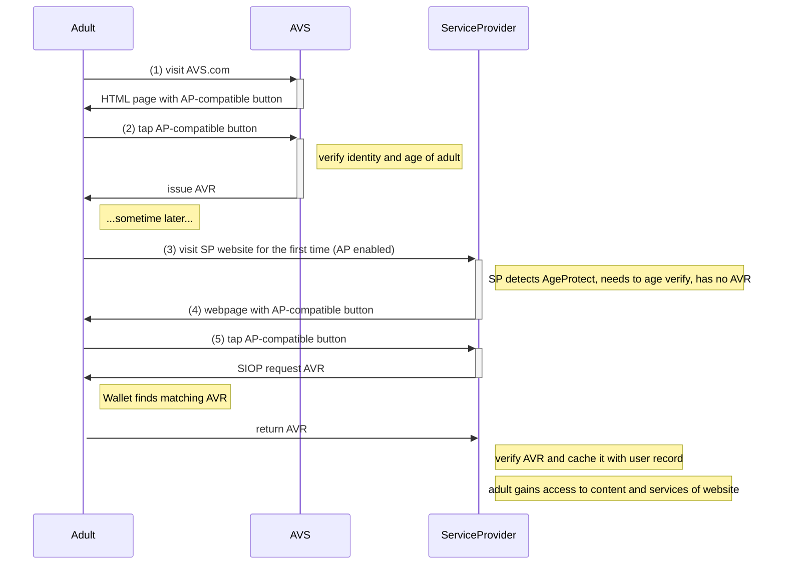

```mermaid
sequenceDiagram
    participant Adult
    participant AVS
    participant ServiceProvider
    Adult->>+AVS: (1) visit AVS.com
    AVS->>-Adult: HTML page with AP-compatible button
    Adult->>+AVS: (2) tap AP-compatible button
    Note right of AVS: verify identity and age of adult
    AVS->>-Adult: issue AVR
    Note right of Adult: ...sometime later...
    Adult->>+ServiceProvider: (3) visit SP website for the first time (AP enabled)
    Note right of ServiceProvider: SP detects AgeProtect, needs to age verify, has no AVR
    ServiceProvider->>-Adult: (4) webpage with AP-compatible button
    Adult->>+ServiceProvider: (5) tap AP-compatible button
    ServiceProvider->>-Adult: SIOP request AVR
    activate Adult
    Note right of Adult: Wallet finds matching AVR
    Adult->>ServiceProvider: return AVR
    Note right of ServiceProvider: verify AVR and cache it with user record
    Note right of ServiceProvider: adult gains access to content and services of website
```